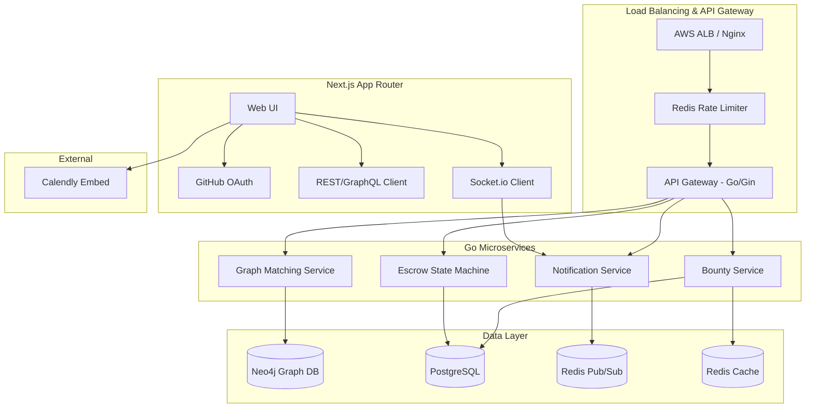

# 🚀 System Design: Cross-Team Knowledge Relay Platform
**Target Audience**: Meta E5 / Google L5 / Amazon Bar Raiser
**Role**: Staff-level Engineer / Distributed Systems Architect

## 1. High-Level Architecture Diagram



## 2. Graph Modeling & Database Schema Strategy

While Neo4j handles the knowledge graph and matching, a relational DB (PostgreSQL) is used for transactional consistency (Escrow, Financials).

### Relational Schema (PostgreSQL)
- **Users**: `id`, `github_id`, `name`, `reputation_score`, `created_at`
- **Bounties**: `id`, `poster_id`, `status` (OPEN, ACCEPTED, RESOLVED, EXPIRED), `amount`, `expires_at`, `created_at`
- **Escrow**: `id`, `bounty_id`, `expert_id`, `status` (HELD, RELEASED, REFUNDED), `updated_at`

### Graph Model (Neo4j)
**Nodes**:
- `(:Engineer {id, name, reputation})`
- `(:Skill {name, category})`
- `(:Team {name, domain})`
- `(:Bounty {id, amount, timestamp})`

**Relationships**:
- `(Engineer)-[:HAS_SKILL {level: 1-5, last_used: timestamp}]->(Skill)`
- `(Engineer)-[:BELONGS_TO]->(Team)`
- `(Bounty)-[:REQUIRES {weight: 1.0}]->(Skill)`
- `(Engineer)-[:SOLVED {rating: 1-5, date: timestamp}]->(Bounty)`
- `(Engineer)-[:COLLABORATED_WITH {count: X}]->(Engineer)`

## 3. The Matching Algorithm: PageRank + Recency

Matching isn't just "who has the skill." It's "who is the central authority on this skill, who has been active recently, and who is outside the poster's immediate team."

**Algorithm Steps**:
1. **Skill Proximity**: Find experts `E` connected to the bounty's required skills.
2. **Centrality Scoring**: Apply a personalized PageRank algorithm over the `[:SOLVED]` and `[:COLLABORATED_WITH]` edges to find authorities.
3. **Decay/Recency Weighting**: Multiply the score by a time-decay factor `e^(-λt)` where `t` is the time since they last used/solved this skill.
4. **Islands**: Heavily penalize matches within the exact same `(:Team)` to encourage cross-team pollination.

## 4. Escrow State Machine

Escrow requires idempotency and strict transitions to prevent double-payouts.

**States**: `CREATED` -> `HELD` -> `MEETING_CONFIRMED` -> `RELEASED` | `REFUNDED`

**Transitions**:
1. Bounty Posted -> `CREATED`
2. Expert Accepts -> Move funds to `HELD` (Atomic DB transaction).
3. Calendly Webhook -> `MEETING_CONFIRMED`
4. Poster hits "Resolved" -> `RELEASED`
5. TTL Expiry / Poster "Unresolved" -> `REFUNDED`

*Idempotency*: Every transition requires an `Idempotency-Key` in the API header, stored in Redis for 24h.

## 5. Scaling Strategy (10K -> 1M Engineers)

**Horizontal Scalability**: Go/Gin microservices are stateless. Scale compute horizontally behind ALB.
**Graph DB Scaling**: Neo4j read replicas for the heavy matching queries; single leader for writes (profile updates/bounty creation).
**Event-Driven Matching**: 
When a bounty is created, we don't block the HTTP request to compute matches.
- API drops a `BountyCreated` event into an **Apache Kafka** or **Redis Streams** topic.
- A worker consumes the event, runs the Cypher query, and pushes targeted matches via Redis Pub/Sub.
- WebSocket cluster fans out notifications to matched engineers in real-time.

**Failure Handling**:
- *Circuit Breakers (e.g., heavily loading Neo4j)*: If Neo4j latency spikes > 500ms, fallback to a cached Redis index (inverted index of skills -> experts).
- *Backpressure*: If WS clients slow down, drop non-critical "bounty update" packets; ensure reliable delivery only for "bounty matched to YOU" packets.

## 6. Directory Structure

```text
/backend
├── cmd/
│   └── server/main.go
├── internal/
│   ├── api/
│   │   ├── handlers/bounty.go
│   │   └── middleware/auth.go
│   ├── domain/
│   │   ├── models/bounty.go
│   │   └── state/escrow.go
│   ├── infrastructure/
│   │   ├── neo4j/graph_repo.go
│   │   ├── postgres/relational_repo.go
│   │   └── redis/pubsub.go
│   └── service/
│       ├── matcher.go
│       └── checkout.go
├── pkg/
│   └── logger/
└── docker-compose.yml

/frontend
├── app/
├── components/
├── hooks/
│   └── useBountyStream.ts
└── package.json
```

## 7. API Contracts (Sample)

**POST /api/v1/bounties**
```json
{
  "title": "Need help debugging Kafka offset lag",
  "description": "...",
  "skills": ["Kafka", "Go", "Distributed Systems"],
  "bounty_amount": 150,
  "ttl_seconds": 3600
}
```
*Response*: `202 Accepted` (Matching triggered async)

**POST /api/v1/escrow/{id}/release**
*Headers*: `X-Idempotency-Key: uuid`
*Response*: `200 OK`

## 8. Resume Optimization Layer

*How you should describe this project on your Senior/Staff resume:*

- **Distributed Systems & Scale**: "Architected an event-driven Knowledge Relay Platform for 10K+ engineers. Decoupled matching logic using Pub/Sub and WebSocket fan-outs, supporting bursting loads without degrading core API latency."
- **Graph Processing**: "Implemented a skills-based matching engine using Neo4j and Cypher. Engineered a custom personalized PageRank algorithm with time-decay heuristics to surface top-tier domain experts across organizational silos."
- **State Machine & Financials**: "Designed a robust, double-entry Escrow state machine in Go/PostgreSQL. Enforced strict idempotency and optimistic concurrency controls to guarantee 0% race-condition anomalies during payout transitions."
- **Architecture Leadership (Staff Level)**: "Drove architectural decisions mapping polyglot persistence to domain needs: Neo4j for deep relationship traversals, Postgres for ACID transaction boundaries, and Redis for distributed rate-limiting and session state."
