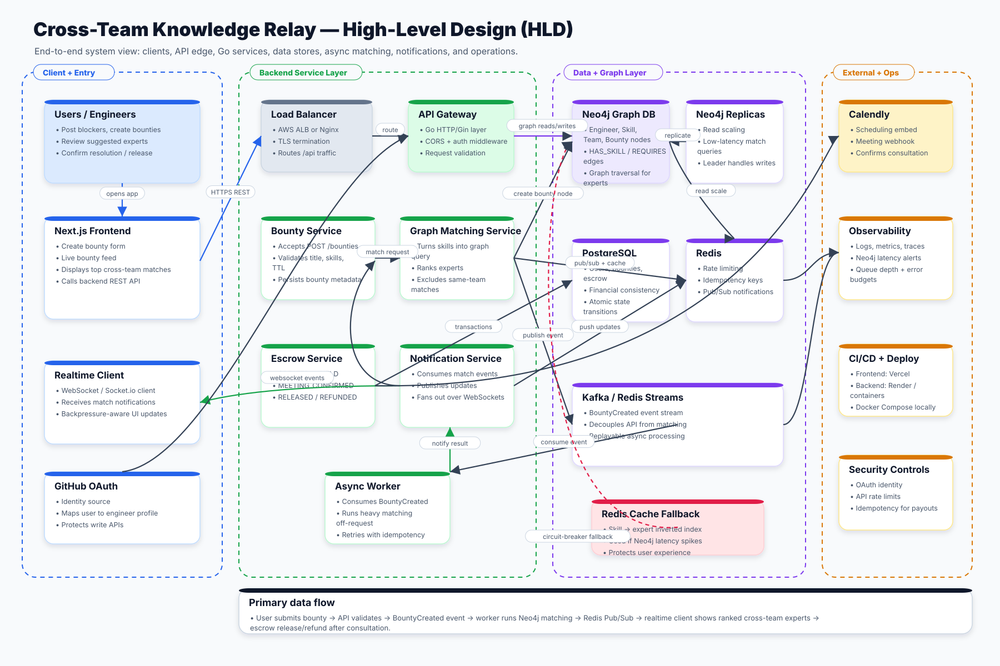
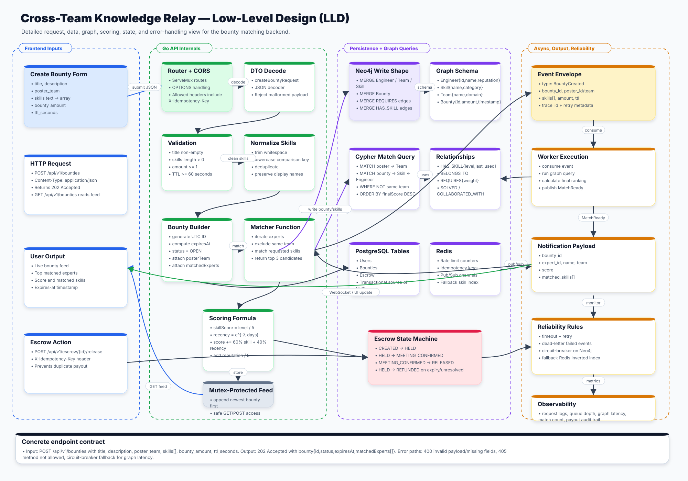

# Architecture Diagrams

This folder contains two clean, standalone SVG architecture images for the Cross-Team Knowledge Relay project. The diagrams intentionally use numbered lanes and mostly horizontal flow lines to avoid the cluttered, crossing-arrow style.

## High-Level Design (HLD)

The HLD diagram shows the system at a service-boundary level: Next.js clients, API edge, Go backend services, Neo4j graph matching, PostgreSQL, Redis, event streaming, realtime notifications, security, observability, fallback behavior, and deployment/scaling concerns.

## Low-Level Design (LLD)

The LLD diagram uses a sequence-style layout for the bounty creation flow: request DTO, routing, validation, skill normalization, graph write/query shape, metadata persistence, async event processing, Cypher matching, expert ranking, notification payloads, and failure handling.
